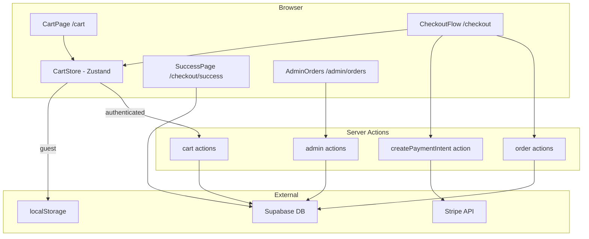
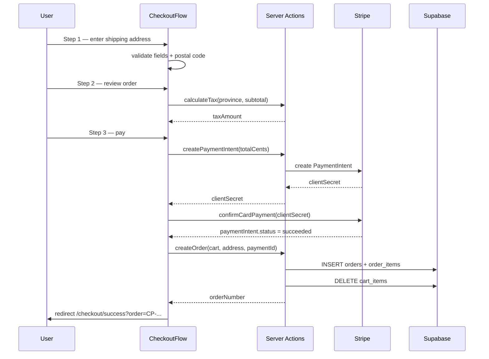

# Design Document: Checkout

## Overview

The Checkout feature delivers a complete purchase flow for CargoPlus — a B2C marketplace selling construction materials sourced from China to Canadian customers. It covers cart persistence (localStorage for guests, Supabase for authenticated users with merge-on-login), a three-step checkout wizard (contact/shipping → order review → Stripe payment), order creation on payment success, and admin order management.

All prices are in CAD. Tax is computed server-side per Canadian province. Shipping is flat-rate displayed as "To be confirmed". Authentication is required to complete checkout; unauthenticated users are redirected to `/auth/login` with a return URL.

### Key Design Decisions

- **Zustand for cart state**: A Zustand store (`lib/stores/cartStore.ts`) acts as the single source of truth for cart state in the browser, syncing to localStorage (guests) or Supabase (authenticated users). This avoids prop-drilling and keeps the cart badge reactive.
- **Server Actions for mutations**: All cart writes, order creation, and admin status updates use Next.js Server Actions in `app/actions/`, consistent with existing patterns.
- **Stripe PaymentIntent flow**: The server creates a PaymentIntent and returns the `client_secret`; the client uses Stripe Elements to confirm. This keeps the secret server-side.
- **Tax as a pure utility**: `lib/tax/calculator.ts` is a pure function with no I/O, making it trivially testable and reusable.
- **Order number format**: `CP-YYYYMMDD-XXXXXX` where the suffix is a random uppercase alphanumeric string, generated server-side at order creation time.
- **Schema migrations**: Three additive migrations add `variant_code`/`variant_image_url` to `cart_items` and `order_items`, and `shipping_cost` to `orders`.

---

## Architecture



### Request Flow: Checkout



---

## Components and Interfaces

### Cart Layer

**`lib/stores/cartStore.ts`** — Zustand store

```typescript
interface CartItem {
  productId: string
  variantCode: string | null
  variantImageUrl: string | null
  productName: string
  productPrice: number  // CAD, from product or variant_price
  quantity: number
}

interface CartStore {
  items: CartItem[]
  // Mutations
  addItem: (item: Omit<CartItem, 'quantity'>, qty: number) => void
  removeItem: (productId: string, variantCode: string | null) => void
  updateQuantity: (productId: string, variantCode: string | null, qty: number) => void
  clearCart: () => void
  // Sync
  loadFromLocalStorage: () => void
  loadFromSupabase: (userId: string) => Promise<void>
  mergeGuestCart: (userId: string) => Promise<void>
  syncToSupabase: (userId: string) => Promise<void>
  // Derived
  itemCount: () => number
  subtotal: () => number
}
```

**`app/actions/cart.ts`** — Server Actions

```typescript
addCartItem(productId: string, variantCode: string | null, variantImageUrl: string | null, quantity: number): Promise<{ error: string | null }>
removeCartItem(productId: string, variantCode: string | null): Promise<{ error: string | null }>
updateCartItemQuantity(productId: string, variantCode: string | null, quantity: number): Promise<{ error: string | null }>
getCartItems(): Promise<{ data: CartItemRow[] | null; error: string | null }>
clearCartItems(): Promise<{ error: string | null }>
mergeGuestCartItems(guestItems: GuestCartItem[]): Promise<{ error: string | null }>
```

### Checkout Flow

**`app/checkout/page.tsx`** — Server Component (auth guard, loads profile)

**`app/checkout/CheckoutFlow.tsx`** — Client Component (`"use client"`)

Manages step state (`1 | 2 | 3`), shipping address state, and tax calculation display.

```typescript
interface ShippingFormData {
  fullName: string
  email: string
  phone: string
  addressLine1: string
  city: string
  province: CanadianProvince
  postalCode: string
}

interface CheckoutState {
  step: 1 | 2 | 3
  shippingData: ShippingFormData | null
  taxBreakdown: TaxBreakdown | null
  clientSecret: string | null
  isProcessing: boolean
  error: string | null
}
```

**`app/checkout/steps/ShippingStep.tsx`** — Step 1 form (Client Component)

**`app/checkout/steps/ReviewStep.tsx`** — Step 2 order review (Client Component)

**`app/checkout/steps/PaymentStep.tsx`** — Step 3 Stripe Elements (Client Component)

**`app/checkout/success/page.tsx`** — Server Component, reads `?order=` param, fetches order from DB.

### Tax Calculator

**`lib/tax/calculator.ts`**

```typescript
interface TaxBreakdown {
  province: CanadianProvince
  provinceName: string
  taxType: 'GST' | 'HST' | 'GST+PST' | 'GST+QST'
  taxLabel: string       // e.g. "HST (13%)"
  taxRate: number        // e.g. 0.13
  taxAmount: number      // CAD, rounded to 2 decimal places
  subtotal: number
  total: number
}

function calculateTax(subtotal: number, province: CanadianProvince): TaxBreakdown
```

### Payment

**`app/actions/payment.ts`** — Server Action

```typescript
createPaymentIntent(amountCents: number): Promise<{ clientSecret: string | null; error: string | null }>
```

**`lib/stripe/client.ts`** — browser-side `loadStripe()` singleton

**`lib/stripe/server.ts`** — server-side `Stripe` instance using `STRIPE_SECRET_KEY`

### Order Service

**`app/actions/orders.ts`** — Server Actions

```typescript
interface CreateOrderInput {
  cartItems: CartItem[]
  shippingAddress: ShippingFormData
  taxBreakdown: TaxBreakdown
  paymentId: string
}

createOrder(input: CreateOrderInput): Promise<{ orderNumber: string | null; error: string | null }>
getOrderByNumber(orderNumber: string): Promise<{ data: OrderWithItems | null; error: string | null }>
```

### Admin Panel

**`app/admin/orders/page.tsx`** — Server Component (admin auth guard)

**`app/admin/orders/OrdersTable.tsx`** — Client Component

**`app/admin/orders/[id]/page.tsx`** — Server Component, order detail

**`app/actions/admin-orders.ts`** — Server Actions

```typescript
getAllOrders(): Promise<{ data: AdminOrderRow[] | null; error: string | null }>
getOrderDetail(orderId: string): Promise<{ data: OrderWithItems | null; error: string | null }>
updateOrderStatus(orderId: string, status: OrderStatus): Promise<{ error: string | null }>
```

### Header Cart Badge

**`components/layout/CartBadge.tsx`** — Client Component, subscribes to `useCartStore().itemCount()`.

---

## Data Models

### Database Schema Changes (new migration)

```sql
-- Migration: Add variant and shipping_cost support to checkout tables

-- cart_items: add variant columns
ALTER TABLE cart_items
  ADD COLUMN IF NOT EXISTS variant_code       TEXT    DEFAULT NULL,
  ADD COLUMN IF NOT EXISTS variant_image_url  TEXT    DEFAULT NULL;

-- Drop old unique constraint (product_id only) and add variant-aware one
ALTER TABLE cart_items DROP CONSTRAINT IF EXISTS cart_items_user_id_product_id_key;
ALTER TABLE cart_items ADD CONSTRAINT cart_items_user_product_variant_key
  UNIQUE (user_id, product_id, variant_code);

-- order_items: add variant columns
ALTER TABLE order_items
  ADD COLUMN IF NOT EXISTS variant_code       TEXT    DEFAULT NULL,
  ADD COLUMN IF NOT EXISTS variant_image_url  TEXT    DEFAULT NULL;

-- orders: add shipping_cost column
ALTER TABLE orders
  ADD COLUMN IF NOT EXISTS shipping_cost DECIMAL(10,2) NOT NULL DEFAULT 0;
```

### localStorage Cart Format

```typescript
// Key: 'cargoplus_cart'
interface LocalStorageCart {
  items: Array<{
    product_id: string
    variant_code: string | null
    variant_image_url: string | null
    product_name: string
    product_price: number
    quantity: number
  }>
}
```

### Order Number Generation

Format: `CP-YYYYMMDD-XXXXXX`

- `YYYYMMDD`: UTC date at creation time
- `XXXXXX`: 6-character random uppercase alphanumeric (`[A-Z0-9]`)
- Generated server-side using `crypto.randomBytes` to ensure collision resistance
- Stored as `UNIQUE` in the `orders` table; on collision (astronomically unlikely), retry once

### Tax Rate Table

| Province(s) | Tax Type | Rate |
|---|---|---|
| AB, NT, NU, YT | GST | 5% |
| BC | GST + PST | 5% + 7% = 12% |
| MB | GST + PST | 5% + 7% = 12% |
| SK | GST + PST | 5% + 6% = 11% |
| QC | GST + QST | 5% + 9.975% = 14.975% |
| ON | HST | 13% |
| NB | HST | 15% |
| NL | HST | 15% |
| NS | HST | 15% |
| PE | HST | 15% |

---

## Correctness Properties

*A property is a characteristic or behavior that should hold true across all valid executions of a system — essentially, a formal statement about what the system should do. Properties serve as the bridge between human-readable specifications and machine-verifiable correctness guarantees.*

### Property 1: localStorage cart serialization round-trip

*For any* collection of cart items, serializing them to the localStorage format and deserializing them back should produce an equivalent collection with all fields (`product_id`, `variant_code`, `variant_image_url`, `quantity`) preserved.

**Validates: Requirements 1.1**

---

### Property 2: Cart merge increments quantities for duplicates

*For any* guest cart and any Supabase cart that share one or more `(product_id, variant_code)` pairs, after merging the guest cart into the Supabase cart, each shared pair's quantity should equal the sum of both carts' quantities for that pair, and all non-overlapping items should be present.

**Validates: Requirements 1.3**

---

### Property 3: Cart merge clears localStorage

*For any* non-empty localStorage cart, after a successful merge into Supabase, the localStorage cart should be empty.

**Validates: Requirements 1.4**

---

### Property 4: Cart badge count equals sum of quantities

*For any* cart state, the numeric badge displayed on the cart icon should equal the sum of all individual item quantities.

**Validates: Requirements 1.5**

---

### Property 5: Out-of-stock products are rejected

*For any* product with `stock_quantity = 0`, attempting to add it to the cart should be rejected and the cart contents should remain unchanged.

**Validates: Requirements 1.6**

---

### Property 6: Adding a duplicate item increments quantity

*For any* cart that already contains a `(product_id, variant_code)` pair, adding the same pair again with quantity `n` should result in the existing item's quantity increasing by `n`, with no new row created.

**Validates: Requirements 2.3**

---

### Property 7: Cart item display includes all required fields

*For any* cart item, the rendered cart row (on `/cart` and in Step 2 of checkout) should include the product name, variant code, variant image, unit price in CAD, quantity, and line total.

**Validates: Requirements 3.1, 5.1**

---

### Property 8: Line total equals unit price times quantity

*For any* unit price `p` and positive integer quantity `q`, the displayed line total should equal `p * q`, rounded to 2 decimal places.

**Validates: Requirements 3.2**

---

### Property 9: Removing an item removes it from the cart

*For any* cart containing at least one item, removing that item should result in it no longer appearing in the cart, with all other items unchanged.

**Validates: Requirements 3.3**

---

### Property 10: Subtotal equals sum of all line totals

*For any* collection of cart items, the displayed subtotal should equal the sum of all individual line totals.

**Validates: Requirements 3.4**

---

### Property 11: Postal code validation accepts valid and rejects invalid formats

*For any* string matching the Canadian postal code regex `[A-Z]\d[A-Z] \d[A-Z]\d`, the validator should accept it. *For any* string not matching that pattern, the validator should reject it.

**Validates: Requirements 4.2**

---

### Property 12: Invalid form submission does not advance the step

*For any* Step 1 form submission containing at least one invalid or empty field, the checkout step should remain at Step 1 and at least one inline error message should be displayed.

**Validates: Requirements 4.3**

---

### Property 13: Tax calculation is correct for every Canadian province

*For any* subtotal `s` and any Canadian province code `p`, `calculateTax(s, p).taxAmount` should equal `s * taxRate(p)` rounded to 2 decimal places, where `taxRate(p)` is the combined rate from the specification table.

**Validates: Requirements 5.2**

---

### Property 14: Order total equals subtotal plus tax

*For any* subtotal and province, the displayed order total should equal `subtotal + calculateTax(subtotal, province).taxAmount`.

**Validates: Requirements 5.3**

---

### Property 15: Step back navigation preserves previously entered values

*For any* valid data entered in Step N, navigating forward to Step N+1 and then clicking "Back" should restore all previously entered values in Step N exactly as they were.

**Validates: Requirements 5.4, 6.6**

---

### Property 16: Pay button label shows exact total

*For any* calculated total `t`, the pay button label should display exactly `"Pay $X.XX CAD"` where `X.XX` is `t` formatted to 2 decimal places.

**Validates: Requirements 6.2**

---

### Property 17: Order creation produces a complete and correct order record

*For any* valid checkout input (cart items, shipping address, tax breakdown, Stripe payment ID), the created `orders` row should contain: a correctly formatted `order_number`, the authenticated `user_id`, `status = 'pending'`, correct `subtotal`, `tax_amount`, `shipping_cost = 0`, `total = subtotal + tax_amount`, the full `shipping_address` JSON, `payment_status = 'paid'`, and the provided `payment_id`.

**Validates: Requirements 7.1, 7.3**

---

### Property 18: Order creation produces one order_item per cart item

*For any* cart with `N` items, the created order should have exactly `N` rows in `order_items`, each capturing the correct `product_id`, `product_name`, `product_price`, `variant_code`, `variant_image_url`, `quantity`, and `line_total`.

**Validates: Requirements 7.2**

---

### Property 19: Order creation clears the user's cart

*For any* user with a non-empty cart, after successful order creation, both the `cart_items` Supabase rows and the localStorage cart for that user should be empty.

**Validates: Requirements 7.4**

---

### Property 20: Success page displays all required order information

*For any* order, the `/checkout/success` page should display the `order_number`, all purchased items (name, quantity, price), the total charged in CAD, and the full shipping address.

**Validates: Requirements 8.1**

---

### Property 21: Order number matches format and is unique

*For any* generated `order_number`, it should match the regex `^CP-\d{8}-[A-Z0-9]{6}$`. *For any* two distinct orders, their `order_number` values should differ.

**Validates: Requirements 9.4**

---

### Property 22: Admin orders table displays all required fields

*For any* order in the system, the admin orders table row should display the `order_number`, customer email, order date, total in CAD, payment status, and fulfilment status.

**Validates: Requirements 10.1**

---

### Property 23: Admin order detail displays complete information

*For any* order with line items, the admin order detail view should display all line items, the shipping address, and the Stripe payment ID.

**Validates: Requirements 10.2**

---

### Property 24: Only valid fulfilment status values are accepted

*For any* status value not in `{pending, processing, shipped, delivered, cancelled, refunded}`, the admin status update action should reject it and return an error.

**Validates: Requirements 10.4**

---

### Property 25: Non-admin users cannot access admin orders

*For any* authenticated user without the `admin` role, a request to `/admin/orders` should result in a redirect to `/`.

**Validates: Requirements 10.5**

---

## Error Handling

| Scenario | Handling |
|---|---|
| Out-of-stock add to cart | Reject with "Out of stock" message; cart unchanged |
| Step 1 validation failure | Inline field errors; step does not advance |
| Stripe PaymentIntent creation failure | Display error in Step 3; pay button re-enabled |
| Stripe card confirmation failure | Display Stripe error message; pay button re-enabled |
| DB write failure after Stripe success | Log `payment_id` + order details to server error log; return "Contact support" error to client |
| Order success page with no `?order=` param | Redirect to `/` |
| Unauthenticated checkout attempt | Redirect to `/auth/login?returnUrl=/checkout` |
| Non-admin accessing `/admin/orders` | Redirect to `/` (handled by existing middleware pattern) |
| Cart merge conflict (DB error) | Log error; keep localStorage cart intact; surface toast error |

---

## Testing Strategy

### Unit Tests

Focus on pure functions and specific examples:

- `calculateTax`: one example per province to verify correct rate and label
- Postal code regex: valid and invalid examples
- Order number generator: format check, uniqueness check with two calls
- Cart subtotal calculation: specific examples with known totals
- Line total calculation: specific price × quantity examples
- Admin status validation: valid and invalid status values

### Property-Based Tests

Use **fast-check** (TypeScript-native PBT library). Each test runs a minimum of **100 iterations**.

Tag format: `// Feature: checkout, Property N: <property text>`

Properties to implement as PBT tests:

| Property | Generator inputs | Assertion |
|---|---|---|
| P1: localStorage round-trip | Arbitrary cart items | `deserialize(serialize(items))` deep-equals `items` |
| P2: Cart merge increments quantities | Two arbitrary carts with possible overlaps | Merged quantities = sum of both for shared pairs |
| P3: Merge clears localStorage | Arbitrary non-empty localStorage cart | After merge, localStorage cart is empty |
| P4: Badge count = sum of quantities | Arbitrary cart items | `badge === items.reduce((s, i) => s + i.quantity, 0)` |
| P5: Out-of-stock rejection | Any product with `stock_quantity = 0` | Cart unchanged after add attempt |
| P6: Duplicate add increments quantity | Arbitrary cart + arbitrary add quantity | Quantity increases by added amount |
| P8: Line total = price × quantity | Arbitrary price (> 0) and quantity (> 0) | `lineTotal === round2(price * quantity)` |
| P10: Subtotal = sum of line totals | Arbitrary cart items | `subtotal === sum(items.map(i => i.lineTotal))` |
| P11: Postal code validation | Arbitrary strings + valid postal codes | Valid format accepted, invalid rejected |
| P13: Tax calculation correctness | All 13 province codes, arbitrary subtotals | `taxAmount === round2(subtotal * rate[province])` |
| P14: Total = subtotal + tax | Arbitrary subtotal + province | `total === subtotal + taxAmount` |
| P17: Order record completeness | Arbitrary checkout inputs | All required fields present with correct values |
| P18: One order_item per cart item | Arbitrary cart (1–20 items) | `order_items.length === cart.length` |
| P21: Order number format + uniqueness | Generate N order numbers | All match regex; all distinct |
| P24: Invalid status rejected | Arbitrary strings not in valid set | Action returns error |

### Integration Tests

- Stripe PaymentIntent creation (Stripe test mode): verify amount in cents, currency = `cad`
- Supabase cart persistence: insert with `variant_code`/`variant_image_url`, verify retrieval
- Order creation end-to-end (mocked Stripe): verify DB rows created correctly
- Admin status update: verify DB row updated

### Smoke Tests

- Schema migration: verify `variant_code`, `variant_image_url` columns exist on `cart_items` and `order_items`; `shipping_cost` exists on `orders`
