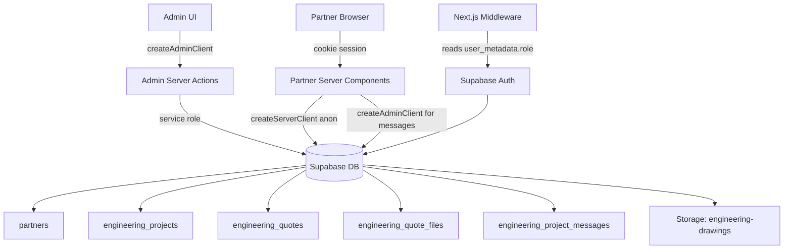

# Design Document: Partner Role

## Overview

The Partner Role feature adds a new `partner` user type to the CargoPlus platform. Partners are Chinese engineering companies that receive all engineering project submissions, review them, and respond with structured quotes. This design extends the existing Supabase auth system, mirrors the established seller/admin patterns, and reuses the existing `ChatDrawer` component for messaging.

The feature touches four layers:
1. **Database** — two new tables (`partners`, `engineering_quotes`, `engineering_quote_files`), RLS policies, and a schema migration
2. **Middleware** — `/partner/*` route protection using `user_metadata.role`
3. **Server Actions** — admin partner management and partner-facing data operations
4. **UI** — partner dashboard layout, projects list, project detail + quote form, and profile page

---

## Architecture



**Key architectural decisions:**

- Partner identity is stored in `user_metadata.role = 'partner'` (same pattern as seller/admin), so the middleware can gate `/partner/*` routes without a DB query.
- The `partners` table stores company profile data, keyed by the same UUID as `auth.users`.
- Partner creation is admin-only and uses `createAdminClient` (service role) to call `auth.admin.createUser`, mirroring how sellers are managed.
- Partners read all engineering projects via RLS policies that check `user_metadata.role = 'partner'`.
- Messaging reuses the existing `ChatDrawer` component and `adminSendPartnerMessage` / `adminGetProjectMessages` server actions — no new message infrastructure needed.

---

## Components and Interfaces

### New Route Tree

```
app/
  partner/
    layout.tsx                  ← PartnerSidebar wrapper (mirrors seller/layout.tsx)
    dashboard/
      page.tsx                  ← Server component, stats
    projects/
      page.tsx                  ← Server component, all projects table
      [id]/
        page.tsx                ← Server component, project detail + quote form
    profile/
      page.tsx                  ← Server component + client form
```

### New Components

| Component | Path | Notes |
|---|---|---|
| `PartnerSidebar` | `components/layout/PartnerSidebar.tsx` | Client component, mirrors `SellerSidebar` |
| `QuoteForm` | `app/partner/projects/[id]/QuoteForm.tsx` | Client component, handles insert/update |
| `PartnerProfileForm` | `app/partner/profile/PartnerProfileForm.tsx` | Client component |

### New Server Actions

| File | Functions |
|---|---|
| `app/actions/partner-admin.ts` | `createPartner`, `listPartners`, `updatePartnerStatus` |
| `app/actions/partner.ts` | `getPartnerDashboardStats`, `getAllProjectsForPartner`, `getProjectDetailForPartner`, `submitQuote`, `getPartnerProfile`, `updatePartnerProfile` |

### Modified Files

| File | Change |
|---|---|
| `middleware.ts` | Add `/partner/*` route protection block |
| `components/layout/HeaderAuth.tsx` | Add `role === 'partner'` branch linking to `/partner/dashboard` |
| `types/database.ts` | Add `Partner`, `EngineeringQuote`, `EngineeringQuoteFile` types |
| `app/admin/partners/page.tsx` | New admin page for partner management |

---

## Data Models

### `partners` table

```sql
CREATE TABLE partners (
  id           UUID PRIMARY KEY REFERENCES auth.users(id) ON DELETE CASCADE,
  company_name TEXT        NOT NULL,
  contact_name TEXT        NOT NULL,
  email        TEXT        NOT NULL,
  phone        TEXT,
  country      TEXT        NOT NULL DEFAULT 'China',
  status       TEXT        NOT NULL DEFAULT 'active'
                           CHECK (status IN ('active', 'suspended')),
  created_at   TIMESTAMPTZ NOT NULL DEFAULT NOW()
);
```

### `engineering_quotes` table

```sql
CREATE TABLE engineering_quotes (
  id             UUID    PRIMARY KEY DEFAULT gen_random_uuid(),
  project_id     UUID    NOT NULL REFERENCES engineering_projects(id) ON DELETE CASCADE,
  partner_id     UUID    NOT NULL REFERENCES auth.users(id) ON DELETE CASCADE,
  price_cad      NUMERIC NOT NULL,
  timeline_weeks INTEGER NOT NULL,
  validity_days  INTEGER NOT NULL,
  notes          TEXT,
  status         TEXT    NOT NULL DEFAULT 'submitted',
  created_at     TIMESTAMPTZ NOT NULL DEFAULT NOW(),
  UNIQUE (project_id, partner_id)
);
```

The `UNIQUE (project_id, partner_id)` constraint enforces one quote per partner per project, simplifying upsert logic.

### `engineering_quote_files` table

```sql
CREATE TABLE engineering_quote_files (
  id           UUID PRIMARY KEY DEFAULT gen_random_uuid(),
  quote_id     UUID NOT NULL REFERENCES engineering_quotes(id) ON DELETE CASCADE,
  file_name    TEXT NOT NULL,
  storage_path TEXT NOT NULL,
  uploaded_at  TIMESTAMPTZ NOT NULL DEFAULT NOW()
);
```

### RLS Policies

**`partners` table:**
- Partners can SELECT their own row (`id = auth.uid()`)
- Partners can UPDATE their own row
- Admins (service role) have full access

**`engineering_projects` / `engineering_project_drawings`:**
- Add policy: partners can SELECT all rows (`auth.jwt() ->> 'role' = 'partner'` or via `user_metadata`)

**`engineering_quotes`:**
- Partners can INSERT rows where `partner_id = auth.uid()`
- Partners can UPDATE rows where `partner_id = auth.uid()`
- Partners can SELECT all rows (to see their own quotes)
- Customers can SELECT quotes where `project_id` belongs to their project

**`engineering_quote_files`:**
- Partners can INSERT files for their own quotes
- Partners can SELECT files for their own quotes
- Customers can SELECT files for quotes on their own projects

**`engineering_project_messages`:**
- Add policy: partners can INSERT with `sender_role = 'partner'`
- Add policy: partners can SELECT all messages

**Storage (`engineering-drawings` bucket):**
- Add policy: partners can upload under `partner/` prefix

### TypeScript Types

```typescript
export interface Partner {
  id: string;
  company_name: string;
  contact_name: string;
  email: string;
  phone: string | null;
  country: string;
  status: 'active' | 'suspended';
  created_at: string;
}

export interface EngineeringQuote {
  id: string;
  project_id: string;
  partner_id: string;
  price_cad: number;
  timeline_weeks: number;
  validity_days: number;
  notes: string | null;
  status: string;
  created_at: string;
}

export interface EngineeringQuoteFile {
  id: string;
  quote_id: string;
  file_name: string;
  storage_path: string;
  uploaded_at: string;
}
```

---

## Correctness Properties

*A property is a characteristic or behavior that should hold true across all valid executions of a system — essentially, a formal statement about what the system should do. Properties serve as the bridge between human-readable specifications and machine-verifiable correctness guarantees.*

### Property 1: Newly created partners always have status 'active'

*For any* valid partner creation input (email, password, company_name, contact_name, optional phone), the resulting row in the `partners` table SHALL have `status = 'active'`.

**Validates: Requirements 1.3**

---

### Property 2: Partner listing returns all created partners

*For any* set of N partners created via `createPartner`, calling `listPartners` SHALL return at least those N partners, each containing the correct `company_name`, `contact_name`, `email`, `status`, and `created_at` fields.

**Validates: Requirements 1.5**

---

### Property 3: Partner status update round-trip

*For any* partner and any valid status value (`'active'` or `'suspended'`), calling `updatePartnerStatus` then reading the `partners` table SHALL return the updated status value.

**Validates: Requirements 1.6**

---

### Property 4: Middleware blocks non-partners from /partner/* routes

*For any* `/partner/*` path, a request from an authenticated user whose `user_metadata.role` is not `'partner'` SHALL receive a redirect response (to `/` for wrong-role users, to `/auth/login` for unauthenticated users).

**Validates: Requirements 2.3, 2.4**

---

### Property 5: Dashboard statistics are consistent with data

*For any* set of engineering projects and quotes, the dashboard statistics (total, pending, responded) SHALL satisfy: `total = pending + responded`, where `pending` counts projects with no quote from this partner and `responded` counts projects with a quote from this partner.

**Validates: Requirements 3.2**

---

### Property 6: Quoted projects are visually indicated

*For any* project that has an associated quote from the current partner in `engineering_quotes`, the rendered projects table row SHALL contain a "Quoted" indicator.

**Validates: Requirements 4.4**

---

### Property 7: Drawing download links match stored drawings

*For any* project with N associated drawings in `engineering_project_drawings`, the project detail page SHALL render exactly N download links, each corresponding to a signed URL for the drawing's `storage_path`.

**Validates: Requirements 5.2**

---

### Property 8: Quote submission round-trip preserves all fields

*For any* valid quote input (price_cad, timeline_weeks, validity_days, notes), submitting the quote form SHALL result in a row in `engineering_quotes` with `status = 'submitted'` and field values matching the submitted input exactly.

**Validates: Requirements 5.4**

---

### Property 9: Quote pre-population matches stored values

*For any* existing quote in `engineering_quotes`, the quote form pre-population SHALL display values that exactly match the stored `price_cad`, `timeline_weeks`, `validity_days`, and `notes` fields.

**Validates: Requirements 5.5**

---

### Property 10: Partner messages always have sender_role='partner'

*For any* message content sent via `sendPartnerMessage`, the resulting row in `engineering_project_messages` SHALL have `sender_role = 'partner'`.

**Validates: Requirements 6.2**

---

### Property 11: Sending a message transitions pending projects to in_review

*For any* engineering project with `status = 'pending'`, sending a partner message SHALL update the project's status to `'in_review'`. For projects with any other status, the status SHALL remain unchanged.

**Validates: Requirements 6.5**

---

### Property 12: Partner profile display matches database

*For any* partner profile stored in the `partners` table, the profile page SHALL display values for `company_name`, `contact_name`, `phone`, and `country` that exactly match the stored row.

**Validates: Requirements 7.1**

---

### Property 13: Partner profile update round-trip

*For any* valid profile update input, submitting the profile form SHALL result in the `partners` table row reflecting the new `company_name`, `contact_name`, `phone`, and `country` values.

**Validates: Requirements 7.2**

---

### Property 14: Partners can only write their own quotes (RLS)

*For any* partner, attempting to INSERT or UPDATE a row in `engineering_quotes` where `partner_id ≠ auth.uid()` SHALL be rejected by RLS.

**Validates: Requirements 5.7**

---

## Error Handling

| Scenario | Handling |
|---|---|
| Admin creates partner with duplicate email | `createAdminClient().auth.admin.createUser` returns error; surface message to admin UI |
| Quote submission DB error | `QuoteForm` catches error, displays message, keeps form data in state (no reset) |
| Password change failure | `updateUser` error message surfaced directly in the profile form |
| Partner accesses route while suspended | Dashboard renders suspension banner; all data still loads (suspension is informational, not a hard block at the route level) |
| Signed URL generation failure for drawings | Log error, render link as disabled/unavailable rather than crashing the page |
| File upload failure during quote submission | Log per-file error, continue with remaining files, surface a warning (mirrors existing drawing upload pattern in `engineering.ts`) |
| Unauthenticated `/partner/*` access | Middleware redirects to `/auth/login` |
| Wrong-role `/partner/*` access | Middleware redirects to `/` |

---

## Testing Strategy

### Unit / Example Tests

- `createPartner` with duplicate email returns descriptive error (Req 1.2)
- `HeaderAuth` renders `/partner/dashboard` link when `user_metadata.role = 'partner'` (Req 2.2)
- Partner layout renders sidebar with Dashboard, Projects, Profile links (Req 3.1)
- Dashboard renders suspension banner when partner status is `'suspended'` (Req 3.4)
- Project detail page renders all required fields with mock data (Req 5.1)
- Quote form renders all required fields (Req 5.3)
- Quote form shows error and preserves data on failed submission (Req 5.6)
- Profile page renders change-password form (Req 7.3)
- Password change failure surfaces error message (Req 7.4)

### Property-Based Tests

Using [fast-check](https://github.com/dubzzz/fast-check) (already consistent with the TypeScript/Next.js stack). Each property test runs a minimum of 100 iterations.

- **Feature: partner-role, Property 1**: Newly created partners always have status 'active'
- **Feature: partner-role, Property 2**: Partner listing returns all created partners
- **Feature: partner-role, Property 3**: Partner status update round-trip
- **Feature: partner-role, Property 4**: Middleware blocks non-partners from /partner/* routes
- **Feature: partner-role, Property 5**: Dashboard statistics are consistent with data
- **Feature: partner-role, Property 6**: Quoted projects are visually indicated
- **Feature: partner-role, Property 7**: Drawing download links match stored drawings
- **Feature: partner-role, Property 8**: Quote submission round-trip preserves all fields
- **Feature: partner-role, Property 9**: Quote pre-population matches stored values
- **Feature: partner-role, Property 10**: Partner messages always have sender_role='partner'
- **Feature: partner-role, Property 11**: Sending a message transitions pending projects to in_review
- **Feature: partner-role, Property 12**: Partner profile display matches database
- **Feature: partner-role, Property 13**: Partner profile update round-trip
- **Feature: partner-role, Property 14**: Partners can only write their own quotes (RLS)

Properties 1–3, 5–6, 8–13 test pure data transformation logic and can run fully in-memory with mocked Supabase clients. Properties 4 and 14 test middleware/RLS behavior and require either a local Supabase instance or a mock that enforces the policy logic.

### Smoke / Integration Tests

- Migration 008 creates `partners`, `engineering_quotes`, `engineering_quote_files` tables with correct columns and constraints (Req 8.1–8.3)
- `profiles` table CHECK constraint accepts `'partner'` role (Req 8.4)
- Storage policy allows partner uploads under `partner/` prefix (Req 8.5)
- RLS policies exist for partner SELECT on `engineering_projects` (Req 4.1)
- RLS policies exist for customer SELECT on `engineering_quotes` (Req 5.8)
- Partner messaging RLS policies exist (Req 6.3, 6.4)
- Partner chat fetch uses admin client (Req 6.1)
