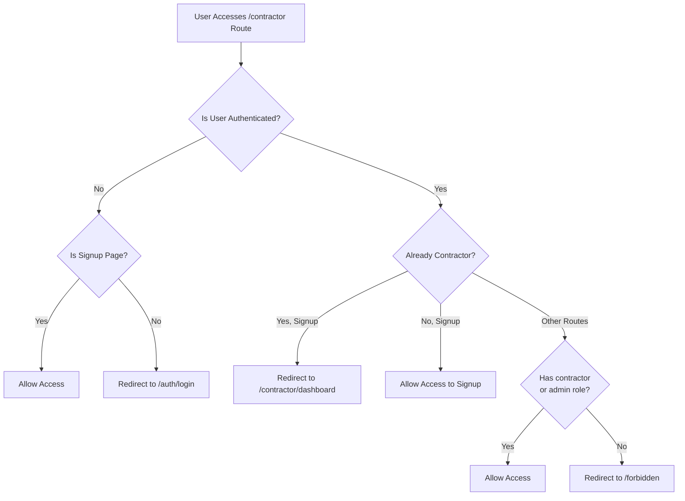

# Middleware Authentication & Authorization Implementation

## Overview
Complete implementation of role-based authentication and authorization middleware for contractor and admin routes in the Cargoplus e-commerce platform.

## Files Updated

### 1. **middleware.ts** (Updated)
**Location:** `cargoplus-ecommerce/middleware.ts`

**Changes:**
- Enhanced contractor routes protection with special handling for signup page
- Added distinction between `/contractor/signup` (public/unauthenticated) and other contractor routes
- Updated contractor route logic to allow both contractors and admins
- Maintains existing seller, admin, agent, partner, and account route protections

**Contractor Route Logic:**
```
/contractor/signup:
  - Unauthenticated users: Can access signup form
  - Authenticated users (already contractors): Redirect to /contractor/dashboard
  - Authenticated users (non-contractors): Can access signup form

/contractor/* (other routes):
  - Unauthenticated users: Redirect to /auth/login
  - Users without contractor/admin role: Redirect to home
  - Contractors & admins: Full access
```

---

## Pages Updated

### 2. **app/contractor/signup/page.tsx** (Updated)
**Location:** `cargoplus-ecommerce/app/contractor/signup/page.tsx`

**Changes:**
- Converted to async Server Component
- Added Supabase server client initialization
- Checks if user is already a contractor and redirects to dashboard
- Allows unauthenticated users and non-contractor users to view signup form

**Key Features:**
- Server-side role verification using Supabase
- Prevents already-registered contractors from re-registering
- Graceful handling of unauthenticated access

---

### 3. **app/contractor/dashboard/page.tsx** (Updated)
**Location:** `cargoplus-ecommerce/app/contractor/dashboard/page.tsx`

**Changes:**
- Enhanced role verification to allow both contractors and admins
- Added proper error redirect to `/forbidden` page
- Improved authorization logic
- Maintains existing contractor data fetching

**Authorization Rules:**
- Must be authenticated (redirect to `/auth/login` if not)
- Must have `contractor` OR `admin` role (redirect to `/forbidden` if neither)
- Must have contractor profile in database

---

### 4. **app/admin/contractors/page.tsx** (Updated)
**Location:** `cargoplus-ecommerce/app/admin/contractors/page.tsx`

**Changes:**
- Updated error redirect from `/` to `/forbidden`
- Maintains strict admin-only access control
- Uses Supabase session and profile verification

**Authorization Rules:**
- Must be authenticated (redirect to `/admin/login` if not)
- Must have `admin` role (redirect to `/forbidden` if not)

---

## Error Pages Created

### 5. **app/unauthorized/page.tsx** (New)
**Location:** `cargoplus-ecommerce/app/unauthorized/page.tsx`

**Purpose:** 401 Unauthorized error page
**Status Code:** 401 (Not Authenticated)
**Features:**
- Informative message about authentication requirement
- Links to Login, Register, and Home
- Uses application color scheme (purple/gold)
- Helpful guidance on next steps

---

### 6. **app/forbidden/page.tsx** (New)
**Location:** `cargoplus-ecommerce/app/forbidden/page.tsx`

**Purpose:** 403 Forbidden error page
**Status Code:** 403 (Insufficient Permissions)
**Features:**
- Clear message about permission denial
- Explains insufficient role/permissions
- Links to Home, Dashboard, and Support
- Support contact information
- Uses warning color scheme (orange)

---

## Authentication Flow Diagram



---

## Role-Based Access Control Summary

### /contractor/signup
| User Type | Status | Action |
|-----------|--------|--------|
| Unauthenticated | Public | ✅ Access Granted |
| Authenticated (contractor) | Registered | ↪️ Redirect to Dashboard |
| Authenticated (non-contractor) | Not Registered | ✅ Access Granted |

### /contractor/dashboard (and other protected routes)
| User Type | Status | Action |
|-----------|--------|--------|
| Unauthenticated | Not Logged In | ↪️ Redirect to Login |
| Contractor | Authorized | ✅ Access Granted |
| Admin | Authorized | ✅ Access Granted |
| Other Roles | Not Authorized | ↪️ Redirect to Forbidden |

### /admin/contractors
| User Type | Status | Action |
|-----------|--------|--------|
| Unauthenticated | Not Logged In | ↪️ Redirect to Admin Login |
| Admin | Authorized | ✅ Access Granted |
| Non-Admin | Not Authorized | ↪️ Redirect to Forbidden |

---

## Middleware Configuration

**Protected Routes in matcher config:**
```
/account/:path*       - Customer accounts (requires authentication)
/seller/:path*        - Seller routes (requires seller role)
/admin/:path*         - Admin routes (requires admin role)
/partner/:path*       - Partner routes (requires partner role)
/agent/:path*         - Agent routes (requires agent role)
/shipping-agent/:path* - Shipping agent routes (requires shipping_agent role)
/contractor/:path*    - Contractor routes (role-based protection)
```

---

## Key Implementation Details

### Database Checks
- **profiles table** - Primary source of role information
- **contractors table** - Verification of contractor profile existence
- **Supabase Auth** - User authentication status

### Error Handling
- Graceful fallback for database query errors in middleware
- Proper error messages on dedicated error pages
- Support contact information on 403 page

### Security Measures
1. **Server-side validation** - Role checks happen in middleware and server components
2. **No client-side trust** - Client components don't determine access
3. **Consistent redirect logic** - All routes follow same protection pattern
4. **Proper HTTP status codes** - Uses redirects (3xx) and dedicated error pages

---

## Testing Recommendations

### Test Cases for Contractor Routes:

1. **Unauthenticated Access to Signup**
   - Expected: ✅ Access granted to `/contractor/signup`
   - Result: Signup form displays

2. **Contractor Accessing Signup**
   - Expected: ↪️ Redirect to `/contractor/dashboard`
   - Result: Redirected to dashboard

3. **Unauthenticated Access to Dashboard**
   - Expected: ↪️ Redirect to `/auth/login`
   - Result: Redirected to login page

4. **Non-Contractor Accessing Dashboard**
   - Expected: ↪️ Redirect to `/forbidden`
   - Result: 403 Forbidden page displays

5. **Contractor Accessing Dashboard**
   - Expected: ✅ Access granted
   - Result: Dashboard displays with user data

6. **Admin Accessing Dashboard**
   - Expected: ✅ Access granted
   - Result: Dashboard displays with contractor data

---

## Future Enhancements

1. **Custom error pages with proper HTTP status codes**
   - Currently uses redirects; could return actual 401/403 responses

2. **Detailed audit logging** for authorization failures

3. **Role-based content rendering** in admin pages (different views for audit/management)

4. **Contractor application workflow** integration in signup page

5. **Session management** with automatic logout on permission loss

---

## Troubleshooting

### User redirected to forbidden page on contractor dashboard
**Possible causes:**
- User profile role not set to 'contractor' or 'admin' in database
- Profile query returning null
- Role mismatch between auth metadata and profiles table

**Solution:** Check `profiles` table for user's role value

### Contractor already registered sees signup form again
**Possible causes:**
- Role not updated in profiles table to 'contractor'
- Cache issues with browser

**Solution:** Verify profile.role = 'contractor' and clear browser cache

### Redirect loop between login and protected routes
**Possible causes:**
- Supabase auth state not properly persisting
- Cookie issues

**Solution:** Check Supabase session handling and browser cookie settings

---

## Deployment Notes

- No new environment variables required
- Uses existing Supabase configuration
- Middleware runs on every request to protected routes
- Error pages are fully static (no API calls)
- Compatible with Next.js SSR and middleware features
